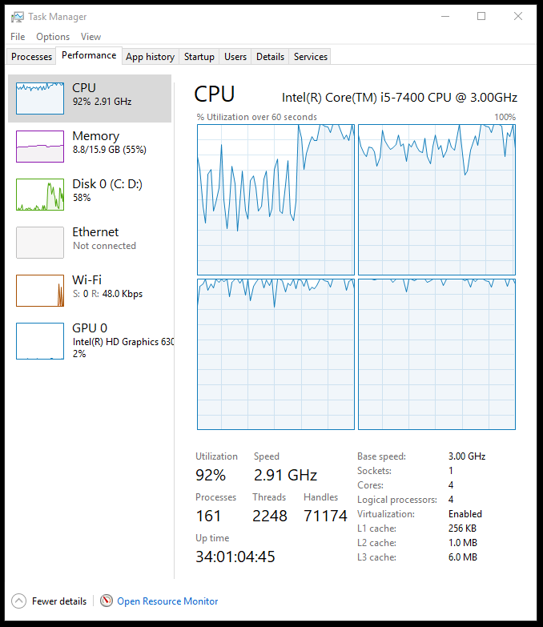
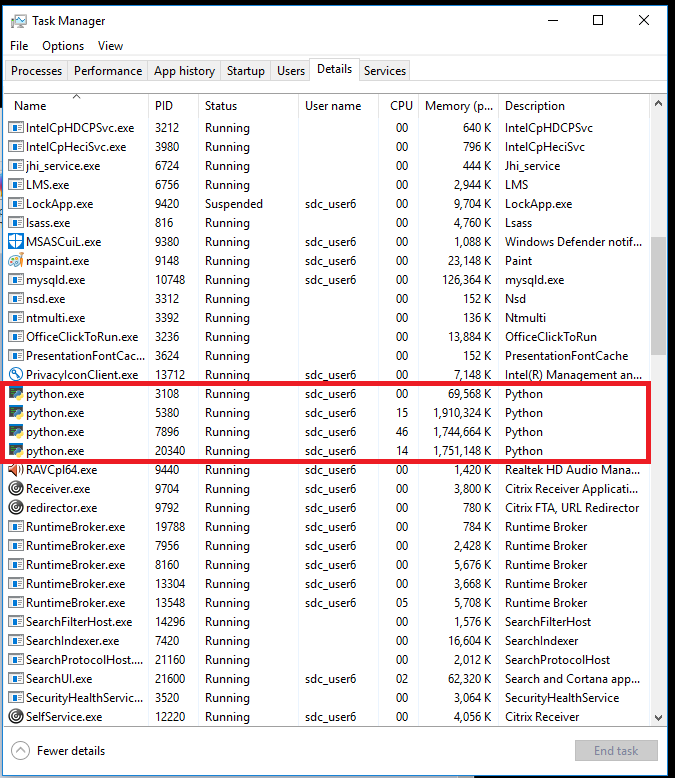

<!--56789012345678901234567890123456789012345678901234567890123456789012345678901234

utf-8 superscripts
¹²³⁴⁵⁶⁷⁸⁹⁰⁻

for external links
[⇗]
-->

## Technology Report

This report enumerates the technologies used in the `anomaly-py` project and
the reasoning behind their use.

> This file is originally in Markdown and is intended to be viewed on a device
> with an internet connection. To view the current version, see this
> file at https://github.com/aadspace/anomaly-py/blob/master/Docs/Tech.md

<!--
This document is not an installation guide. For that purpose, please see
[this](TODO).
-->

 

### Contents
* [Development and deployment tools](#development-and-deployment-tools)
    * [Git](#Git)
    * [Python and required libraries](#python-and-required-libraries)
    * [`vscode`](#vscode)
    * [`mysql`](#mysql)
* [Processing time considerations](#processing-time-considerations)
    * [Reading *.SAS7BDAT files](#reading-sas7bdat-files)
    * [CPU usage](#cpu-usage)
* [Recommendations for hardware improvement](#recommendations-for-hardware-improvement)
     * Faster read-write with SSDs
     * More parallel runs with a higher thread-count CPU
     * Parallelism via LAN: Separate machines for data storage and processing

 

-------------------------------------------------------------------------------

 

## Development and deployment tools

 

### Git

Git is used for version control and sync with a remote repository which is
necessary during Work From Home (WFH). The `anomaly-py` project is stored in
GitHub at https://github.com/aadspace/anomaly-py.

Membership with https://github.com/aadspace is required to access the project
files, and access permissions are managed on a per-user, per-project basis.

Confidential data such as raw data and login keys are not pushed to the
repository. Synthetic data are used for development in a WFH environment.

 

### Python and required libraries

[Python 3.7[⇗]](https://www.python.org/downloads/release/python-379/) is
selected for the project due to the requirements of `tensorflow`.

The following packages are used:

* `docx` [pypi[⇗]](https://pypi.org/project/python-docx)
* `docx2pdf` [pypi[⇗]](https://pypi.org/project/docx2pdf)
* `hyperopt` [pypi[⇗]](https://pypi.org/project/hyperopt)
* `keras` [pypi[⇗]](https://pypi.org/project/Keras)
* `matplotlib` [pypi[⇗]](https://pypi.org/project/matplotlib)
* `mysql.connector` [dev.mysql.com[⇗]](https://dev.mysql.com/downloads/connector/python/)
* `numpy` [pypi[⇗]](https://pypi.org/project/numpy)
* `pandas` [pypi[⇗]](https://pypi.org/project/pandas)
* `psutil` [pypi[⇗]](https://pypi.org/project/psutil)
* `scipy` [pypi[⇗]](https://pypi.org/project/scipy)
* `sklearn` [pypi[⇗]](https://pypi.org/project/scikit-learn)
* `tensorflow` [pypi[⇗]](https://pypi.org/project/tensorflow)
* `tqdm` [pypi[⇗]](https://pypi.org/project/tqdm)

For the actual components used, please see the source code.

Third-party package and environment managers such as Anaconda are not
explicitly used, and python scripts are called from the shell using a Windows
.BAT file to target the specific Python bundle with the aforementioned packages
installed.

 

### `vscode`

Microsoft [Visual Studio Code[⇗]](https://code.visualstudio.com/) is used to write
and debug source code, manage project files, and interface with Git.

 

### `mysql`

Oracle [MySQL Community Edition[⇗]](https://www.mysql.com/products/community/) is
used to stage input data, store results, and enable access thru SQL.

The advantages of this is explained in the section
[Reading *.SAS7BDAT files](#reading-sas7bdat-files).

 

-------------------------------------------------------------------------------

 

## Processing time considerations

The first version of the project is envisioned to be a proof-of-concept
of a Python-based process, and was developed to mimic the workflow of
`anomaly-sas` (https://github.com/aadspace/anomaly-sas) as follows:

 

| Stage | `anomaly-sas` | `anomaly-py`
|---|---|---
| Input | Read 5 years worth of data | Read 5 years worth of data
| Process | Detect spikes using *statistical modeling* | Detect spikes using *machine learning*
| Output | One PDF per FI | One PDF per FI

 

The *statistical modeling* method used a threshold check on the standard
deviation against a smoothened trendline generated from the Hodrick-Prescott
filter using `proc ucm`, adapted from an example from the
[SAS documentation[⇗]](https://documentation.sas.com/?cdcId=pgmsascdc&cdcVersion=9.4_3.4&docsetId=etsug&docsetTarget=etsug_ucm_overview.htm&locale=en).

<!-- TODO Use chelsea's write-up -->
The *machine learning* method used is an LSTM Autoencoder, a specific
implementation of a neural network. An example with explanations is available
[here[⇗]](/Docs/Demos/autoencoder.ipynb).
The algorithm used in `anomaly-py` differs
from the aforementioned example since the usage is different, but the approach
is roughly the same.

As of this writing, the project has proved that an end-to-end process is viable
and therefore allows us to assert that:
* Python may be used in a production environment for the purposes of DSA-SAG,
* Problems with Python packages and their dependencies can be resolved
regardless of environment, and
* Python (with dependencies installed) will work on the current production
hardware for the quintessential data science project in a Jupyter notebook, but
may not be feasible for a Python-based production workflow where millions of
data points are involved, structured or otherwise, and when processing time is
decided by the end-users of DSA-SAG.

With regards to the last assertion, the succeeding sections will describe the
difficulties encountered leads to, and the decisions and steps taken to
mitigate these difficulties.

<!-- TODO Recheck this before submission -->
To date, the June-end 2020 output for `anomaly-py` has not yet reached
completion, though partial PDF outputs may generated per request.

Where tests for the sake of comparison are performed, components of both
`anomaly-sas` and `anomaly-py` are run on the production machines containing
the respective projects. See the following table for the hardware specs.

 

|| `anomaly-sas` | `anomaly-py`
|---|---|---|
| Computer Name | D18-00049048 | D18-00048824
| Premises | SAG-SID | SAG-AAD Lab
| CPU | Intel i5-7400 | *same*
| RAM¹ | 8 GB | 16 GB
| Discrete GPU² | *none* | *none*
| Storage | 1 unit, 512 GB HDD³ | *same*
| Network | LAN | *disconnected*

 

**¹** It is *assumed* that the RAM
[module[⇗]](https://upload.wikimedia.org/wikipedia/commons/b/bc/DIMMs.jpg)
installed in both PCs are of the same
[specs[⇗]](https://medium.com/@corymaklin/understanding-your-computers-specs-part-2-random-access-memory-ram-2df603d013fa)
and the only difference is that one 8 GB module is installed the machine that
runs `anomaly-sas` while that for `anomaly-py` has two 8 GB modules.

**²** A
[discrete GPU[⇗]](https://www.pcmag.com/encyclopedia/term/discrete-graphics)
(sometimes referred to as a *graphics card*) is not
installed in the machines provided to DSA.
The `tensorflow-gpu` package, which may be better than the currently-used
`tensorflow` package in terms of performance, will only work with
[GPUs that support CUDA[⇗]](https://www.tensorflow.org/install/gpu).

**³** Only one physical Hard Disk Drive (HDD) is provided for each machine.
A single hard drive is
[partitioned[⇗]](https://baseline-data.com/blog/disaster-recovery-news/disk-partitioning-good-bad-techy/)
to `C:` (contains Windows OS and program files) and `D:` (presented as
free-to-use data storage). Even if these look separate from the end-user's
standpoint, both "drives" are on the same device. This means that a slowdown
due to a workload on `D:` may cause slowdowns on other processes using `C:`.

Tests are expected to be done with minimal interference, however some
background processes such as anti-virus software cannot be disabled due to
Windows user permission constraints.

 

### Reading *.SAS7BDAT files

Historical data for a given report item (e.g., FRP *Cash on Hand*) must be
rebuilt from separate *.SAS7BDAT files which are maintained by SAG-SID.

All data needed for processing cannot be stored in
[primary memory[⇗]](https://www.guru99.com/primary-vs-secondary-memory.html#2)
as RAM space is limited. It was decided that after the process of collecting, filtering, transforming data, the data should be placed in a
[Relational Database Management System (RDBMS)[⇗]](http://www.agiledata.org/essays/relationalDatabases.html) such as MySQL.

*Pros*:
* MySQL Community Edition is free and working without any convoluted setup
process or installation
* Databases can be
[normalized[⇗]](https://en.wikipedia.org/wiki/Database_normalization)
to make efficient use of disk space
* Fast data access using [indexes such as primary keys[⇗]](https://www.oreilly.com/library/view/high-performance-mysql/0596003064/ch04.html)
* MySQL [provides NoSQL features[⇗]](https://mysql.wisborg.dk/2018/09/10/nosql-x-devapi-tutorial-with-mysql-connector-python-8-0/)
* Supports multiple concurrent access from separate processes
* Accessible over LAN (if allowed through the local firewall)

*Cons*:
* A backround process must be running to serve SQL to client applications
* Databases are still saved to disk, and access is affected by disk usage
* [MySQL cannot directly access *.SAS7BDAT files and a separate process must load the data to MySQL[⇗]](https://www.dbasupport.com/forums/showthread.php?63511-from-sas-sas7bdat-to-mysql)

While MySQL cannot handle *.SAS7BDAT files, data already loaded in
MySQL do not have to be reuploaded to be used in the future. To illustrate:

 

||| Direct access to *.SAS7BDAT | Using MySQL
|---|---|---|---
| Initial 20200630 Run | Input | 60 files (20150731-20200630 data) | 60 files (20150731-20200831 data)
|| Preload | None | Data of 60 files must be uploaded to MySQL tables
|| Subset selection | Sequential, data is read per row as defined by SAS7BDAT format **60 input files must be read** | Indexed, faster than sequential  MySQL fetches data more efficiently if primary keys are used
| Succeeding 20200731 Run | Input | 60 files (20150831-20200731 data) | 60 files (20150831-20200731 data)
|| Preload | None | **Only 1 file** (20200731) must be uploaded to MySQL tables No need to reupload previous data if already existing
|| Subset selection | Sequential **60 input files must be read** | Indexed 

 

To compare data reads of Sequential, direct access to *.SAS7BDAT
against Indexed access from data *already uploaded* to MySQL
([source[⇗]](./Tech_md_read1.py))
:

 

|| Sequential | Indexed
|---|---|---
| Select historical subset  of one report item of one FI | Direct access to *.SAS7BDAT | Using MySQL
| Run time | 0:06:40.057046 | 0:00:01.018405

 

The "preload" will only be time-consuming at the initial run.

 

### CPU usage

As the processing in the production environment is not yet complete, an actual
measure of the total running time for the input data is not available. However,
an estimate can be calculated from items that are already complete. The
computations are done programmatically on a live connection to the MySQL
database
([source[⇗]](./Tech_md_cpu.py)).

The number of Financial Institutions available in the data can be determined by
counting the of unique BKCODE values in the database.

<!--

(A) 515
(B) 53.43548387096774
(C) 0:03:33.616079
(D) 68 days, 0:55:59.450152
(E) 22 days, 16:18:39.816717

-->

|| Variable | Value
|---|---|---
| (A) | # of BKCODEs | 515

The data of an FI can be grouped into subsets of time-series data, where each
time-series sequence of data points correspond to the historical data of one
report item.

Not all items should be processed with machine learning algorithms, and
validation is programmed such that processing data that exhibits the following
can be avoided:

1) The historical data is only zeroes
2) The historical data varies very little <!-- (the standard deviation is less than 2.0×10⁻¹² as of [commit c1ad3e4d[⇗]](https://github.com/aadspace/anomaly-py/commit/c1ad3e4d3dc0fbaf0cd952a041c54c43aaf595d5)) -->
3) Records are missing for some TRDATE(s)
4) Records exist for some TRDATE(s) but contain NULL

From the data of FIs that have already completed processing all its report
items, the average number of report items required to be processed per FI can be
computed.

 

|| Variable | Value
|---|---|---
| (B) | Average # items that needs ML processing per FI | 53.435

Out of the 178 items per bank in the current run, only roughly 53 items (~30%)
need to be processed using machine learning.

 

From
[commit d3ec3ae0[⇗]](https://github.com/aadspace/anomaly-py/commit/d3ec3ae0c6acd705b21311dd2cd83e4ca57329a2),
the elapsed time of machine learning operations is uploaded to the database.

 

|| Variable | Value
|---|---|---
| (C) | Average elapsed time of  machine learning processes per report item    in seconds| 3:33.616079  (3 m 33 s)

 

From the above, the total running time can be estimated as follows:

 

|| Variable | Value
|---|---|---
| (D) = (A)×(B)×(C) | Estimated total running time | 68 days, 0:55:59.450  (roughly 69 days)

 

The above estimation assumes that there is only one worker process.
From
[commit 18f718e6[⇗]](https://github.com/aadspace/anomaly-py/commit/18f718e6a03f79621253f74498d9e3c967a8d4b4),
multiple worker processes can be launched to maximize the use of the CPU.

The production machine can effectively handle three concurrent processes.
The additional process in the second screenshot is the "parent" process which
maintains three "child" concurrent processes.

Assuming that the overhead of concurrent workloads is negligible, the estimated
total running time will be as follows:

|| Variable | Value
|---|---|---
| (E) = (D) / 3 | Estimated total running time  For 3 concurrent processes| 22 days, 16:18:39.817  (roughly 23 days)

The generation of output PDFs are not part of the estimate, as this is a
separate process and requires completion of all processing.
PDFs are generated on a per-FI basis, but may be run on a partially-completed
set of data for an FI.

-------------------------------------------------------------------------------

 

## Recommendations for hardware improvement

### Faster read/write with SSDs

Even if MySQL is used to lesses dealing with *.SAS7BDAT files directly, it is
still bound by the speed of the physical medium it uses to store data. This
means that data access may still take longer as data accumulates.

Solid State Drives (SSDs) are
[generally faster](https://sea.pcmag.com/storage/1526/ssd-vs-hdd-whats-the-difference)
than Hard Disk Drives (HDDs) and will expectedly lessen data access, whether
directly reading data in MySQL or processing local *.SAS7BDAT files.

The time reduction cannot be estimated however, since the performance
improvement if compared to the traditional HDDs will vary depending on the SSD
model.

### More parallel processing with a higher core/thread-count CPU

The CPU available is an Intel i5-7400 which is a 4-core, 4-thread CPU.

If it can be assumed that having more
[CPU cores and CPU threads](https://www.guru99.com/cpu-core-multicore-thread.html)
will allow more concurrent processes without bogging down the system, it can
also be assumed that the processing time presented as (E) in the
[CPU usage](#cpu-e)
section will scale with the core or thread count as follows
(assuming the procesing time is consistent regardless of any part):

| CPU | Parallel processes | Running Time
|---|---|---
| Intel i5-7400 (4 Cores, 4 Threads) | 1 (baseline) | 68 days, 0:55:59.450152 (~69 days)
| Intel i5-7400 | 3 | 22 days, 16:18:39.816717 (~23 days)
| Intel i7-10700K (8 Cores, 16 Threads) | 15 | 4 days, 12:51:43.963343 (~4.5 days)
| AMD TR 3990X (64 Cores, 128 Threads) | 127 | 12:51:27.869686 (~13 hours)

Each process requires its own RAM allocation, the available RAM must be
sufficient if the CPU upgarde is expected to run more processes in parallel.

### Parallel processes over LAN

The total workload can also be divided accross separate machines in the network,
as the project is designed to connect to a non-local MySQL server. This means
that another computer can help process the remaining items in the server.

As of writing, applications not endorsed by BSP-ITSS are not allowed through
Windows Firewall by default. MySQL must be allowed through this firewall so
that it can be accessed over the network and parallel processing can occur.

---

*End of document*
